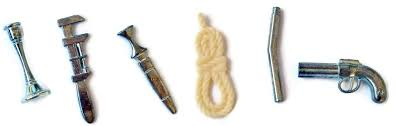
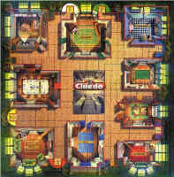

# Testcases

Hieronder de testcases

# Titels

Een hoofdstuk titel maak je met één # (met een spatie erachter)

```
# Titel-1
```
## Titel-2

Een Paragraaf van niveau 2 maak je met twee ##
```
## Titel-2
```
### Titel-3

Een Paragraaf van niveau 3 maak je met drie ###

```
### Titel-3
```
#### Titel-4

Een Paragraaf van niveau 4 maak je met vier ####

```
#### Titel-4
```
##### Titel-5

Een Paragraaf van niveau 5 maak je met vijf #####

```
##### Titel-5
```
###### Titel-6

Een Paragraaf van niveau 6 maak je met zes ######

```
### Titel-6
```

<div class="note">
- Meer dan zes niveaus zijn er niet!
- Je kunt het aantal heading niveaus dat in de table of contents terecht komt, regelen in [config.js](./config.js) met de 'maxTocLevel' parameter.</div>

## Tekst benadrukken

Code:

```*Deze tekst staat cursief*```

Geeft:

*Deze tekst staat cursief*

Code:

```_Deze tekst staat ook cursief_```

Geeft: 

_Deze tekst staat ook cursief_

Code:

```**Deze tekst is vetgedrukt**```

Geeft: 

**Deze tekst is vetgedrukt**

Code:

```__Deze tekst is ook vetgedrukt__```

Geeft: 

__Deze tekst is ook vetgedrukt__

Code:

```~Deze tekst is doorgehaald~```

Geeft: 

~Deze tekst is doorgehaald~

Code:

```*Je **mag** deze ~formaten~ formats ook combineren*```

Geeft: 

*Je **mag** deze ~formaten~ formats ook combineren*

## Blok Quotes
Code:
```
Dr. Green zei:
> Het was ...
> Met de Kandelaar
> in
> de Bibliotheek.
```

Geeft: 
<!-- werkt niet -->
Dr. Green zei:
> Het was ...
> Met de Kandelaar
> in
> de Bibliotheek.

## Lijsten

### Ongesorteerd

Code: 

```
* Keuken
* Hal
* Bibiotheek
 * Kandelaar
 * Touw
```
 Wordt:
* Keuken
* Hal
* Bibiotheek
 * Kandelaar
 * Touw

### Gesorteerd
Code:
```
1. Keuken
2. Hal
3. Bibiotheek
 * Kandelaar
 * Touw
```

Wordt:
1. Keuken
2. Hal
3. Bibiotheek
 * Kandelaar
 * Touw

### Taken/vinklijst
Code:
```
- [x] Gedaan
- [ ] Te doen
- [x] @mentions, #refs, [links](),**formatting**, en <del>tags</del>  worden ondersteund
```

Wordt:
- [x] Gedaan
- [ ] Te doen
- [x] @mentions, #refs, [links](),**formatting**, en <del>tags</del>   worden ondersteund

## Tabellen

Tabellen maak je met **|** en **-**

### Een tabel met **Vette** kopregels

Code:
<pre>
| *RijKop*   | *Kolomkop-1*   | **Kolomkop-2** | **Kolomkop-3** | **Kolomkop-4** |
|------------|----------------|----------------|----------------|----------------|
| Rij-1      | Waarde         | Waarde         | Waarde         | Waarde         |
| Rij-2      | Waarde         | Waarde         | Waarde         | Waarde         |
| Rij-3      | Waarde         | Waarde         | Waarde         | Waarde         |
| Rij-4      | Waarde         | Waarde         | Waarde         | Waarde         |
| Rij-5      | Waarde         | Waarde         | Waarde         | Waarde         |
</pre>

Geeft:

| *RijKop*   | *Kolomkop-1*   | **Kolomkop-2** | **Kolomkop-3** | **Kolomkop-4** |
|------------|----------------|----------------|----------------|----------------|
| Rij-1      | Waarde         | Waarde         | Waarde         | Waarde         |
| Rij-2      | Waarde         | Waarde         | Waarde         | Waarde         |
| Rij-3      | Waarde         | Waarde         | Waarde         | Waarde         |
| Rij-4      | Waarde         | Waarde         | Waarde         | Waarde         |
| Rij-5      | Waarde         | Waarde         | Waarde         | Waarde         |


### Een tabel met **Lege** cellen
Code:
<pre>
| *RijKop*   | *Kolomkop-1*   | **Kolomkop-2** | **Kolomkop-3** | **Kolomkop-4** |
|------------|----------------|----------------|----------------|----------------|
| Rij-1      |                | Waarde         | Waarde         | Waarde         |
| Rij-2      | Waarde         |                | Waarde         | Waarde         |
| Rij-3      | Waarde         | Waarde         | Waarde         | Waarde         |
| Rij-4      | Waarde         | Waarde         | Waarde         |                |
| Rij-5      | Waarde         | Waarde         | Waarde         | Waarde         |
</pre>
Geeft: 

| *RijKop*   | *Kolomkop-1*   | **Kolomkop-2** | **Kolomkop-3** | **Kolomkop-4** |
|------------|----------------|----------------|----------------|----------------|
| Rij-1      |                | Waarde         | Waarde         | Waarde         |
| Rij-2      | Waarde         |                | Waarde         | Waarde         |
| Rij-3      | Waarde         | Waarde         | Waarde         | Waarde         |
| Rij-4      | Waarde         | Waarde         | Waarde         |                |
| Rij-5      | Waarde         | Waarde         | Waarde         | Waarde         |

## Noten

Respec kent een mooie manier om een tekstblok in een noot te zetten:
<pre>
&lt;div class='note'>
    Het was Reverend Green in de Hal
&lt;/div>
</pre>

Of 

<pre>
&lt;aside class='note'>
    Het was Reverend Green in de Hal
&lt;/aside> 
</pre>

Of 

<pre>
&lt;p class='note'>
    Het was Reverend Green in de Hal
&lt;/p> 
</pre>

geeft dit resultaat:

<aside class='note'>
    Het was Reverend Green in de Hal
</aside>

Om een tekstdeel in een lopende tekst als noot te markeren gebruik je een span:

<pre>
Een highlight in de tekst &lt;span class='note'>Dr. Orchid&lt;/span> zie je hier.
</pre>

Een highlight in de tekst <span class='note'>Dr. Orchid</span> zie je hier.

Ditzelfde kan ook met een voorbeeld door `<span class="example">` te gebruiken.

## Voorbeelden/Examples

In je document maak je gebruik van voorbeelden. ReSpec heeft hier een aparte stijl voor en maakt voorbeelden automatisch linkbaar. Een voorbeeld invoegen doe je zo (in plaats van `div` kun je ook hier `aside` of `p` gebruiken):
<pre>
&lt;div class='example'>
Het was Colonel Mustard
&lt;/div>
</pre>

en dat geeft dit resultaat:
<aside class='example'>
    Het was Colonel Mustard
</aside>

## Verwijzigingen

### kruisverwijzing
<!-- doet het niet -->
```
Ik heb hier een tekstverwijzing [^1] naar daar staan.
```
Ik heb hier een tekstverwijzing [^1] naar daar staan.

bla bla bla 
bla bla bla
bla bla bla

en de verwijzing zelf:
```
[^1]: waar is daar? nou: hier.
```
[^1]: waar is daar? nou: hier.

### verwijzing naar hoofdstuk of paragraaf
Je kunt een klikbare link naar een hoofdstuk of paragraaf uit je document maken door:
- de tekst die je zichtbaar als link tekst wilt hebben tussen blokhaken te zetten, en daarachter
- tusse haakjes en achter een # teken de titel van het hoofdstuk of paragraaf waar je heen wilt linken, zonder hoofdletters en met streepjes in plaats van spaties.

Code:
```
Lees verder in het hoofdstuk over [Code blokken](#code-blokken).
```

Geeft:

Lees verder in het hoofdstuk over [Code blokken](#code-blokken).

## Code blokken

Soms wil je stukjes code opnemen in je document, dan zet je er drie qotes voor en drie achter.
Let erop dat je de juiste ` gebruikt. Het is die onder de ~.


<pre>```
function WhoDunnit() 
{
    console.log("It was Dr. Green’, in the Library");
}
```
</pre>

wordt 
```
function WhoDunnit() 
{
    console.log("It was Dr. Green’, in the Library");
}
```

## Issues
ReSpec heeft een aparte stijl voor het markeren van een blok tekst als een issue. 

Code: 
<pre>
&lt;aside class="issue">Hierover is nog discussie.&lt;/aside>
</pre>

Geeft: 
<aside class="issue">Hierover is nog discussie.</aside>

Het issue kan gelinkt worden naar een bestaand Github issue door het issue nummer in `data-number` op te nemen. ReSpec haalt dan de titel, label en tekst van het issue automatisch op. 

Code: 
<pre>
&lt;aside class="issue" data-number="94">Met extra tekst.&lt;/aside>
</pre>

Geeft: 
<aside class="issue" data-number="94">Met extra tekst.</aside>

## Afbeeldingen

### Optie 1 - Markdown
Code:

```

```
Geeft: 


Optie 2: HTML

Er is nog een manier van het opnemen van afbeeldingen in Respec. Deze manier is de HTML manier, die   
er voor zorgt dat de afbeeldingen in een lijst met afbeeldingen terecht komen. In Index.html bepaal je waar in het document  
die lijst terecht komt. 

Code:

```
<figure id="personas">
   
   <figcaption>De spelers</figcaption>
</figure>
<figure id="wapens">
   
   <figcaption>De wapens</figcaption>
</figure>
<figure id="vloerplan">
   
   <figcaption>Het speelbord</figcaption>
</figure>

```
>> zoals je ziet kunnen het id, de img src en de figcaption allemaal verschillende teksten bevatten.

Geeft: 

<figure id="personas">
   
   <figcaption>De spelers</figcaption>
</figure>


<figure id="wapens">
   
   <figcaption>De wapens</figcaption>
</figure>


<figure id="vloerplan">
   
   <figcaption>Het speelbord</figcaption>
</figure>


## Hyperlinks
Code:
```
hyperlinks werken vanzelf, bijvoorbeeld www.geonovum.nl
```
Geeft: 

hyperlinks werken vanzelf, bijvoorbeeld www.geonovum.nl

## Referenties
ReSpec kan een bibliografie voor je genereren onderaan het document. Zet een afkorting van het document waar je naar wilt verwijzen tussen dubbele blokhaken in je tekst. De afkorting wordt klikbaar, en de volledige bibliografische informatie van het document komt in appendix A te staan. De afkorting moet óf bekend zijn bij [SpecRef](https://www.specref.org/) (de bibliografische database van W3C, te raadplegen via de ReSpec knop rechtsboven in je document), óf in je [config.js](./config.js) zijn opgenomen als bibliografisch gegeven. 

Code:
<pre>
Een paar verwijzingen naar de localBiblio staan hier [[GIF]]
zie vooral ook [[!KANDELAAR]] voor het alternatief gebruik van Kandelaars
</pre>

Waarbij het gebruik van een uitroepteken aangeeft dat een verwijzing normatief is. 

Geeft: 

Een paar verwijzingen naar de localBiblio staan hier [[GIF]]

zie vooral ook [[!KANDELAAR]] voor het alternatief gebruik van Kandelaars


## Meer lezen
Dit voorbeelddocument is niet uitputtend. Meer lezen? Zie: 
- [W3C ReSpec instructies](https://github.com/geonovum/respec/wiki), aangevuld met instructies specifiek voor Geonovum
- Documentatie over [Markdown support in ReSpec](https://github.com/w3c/respec/wiki/format)
- [Meer over Markdown](https://github.github.com/gfm/)

