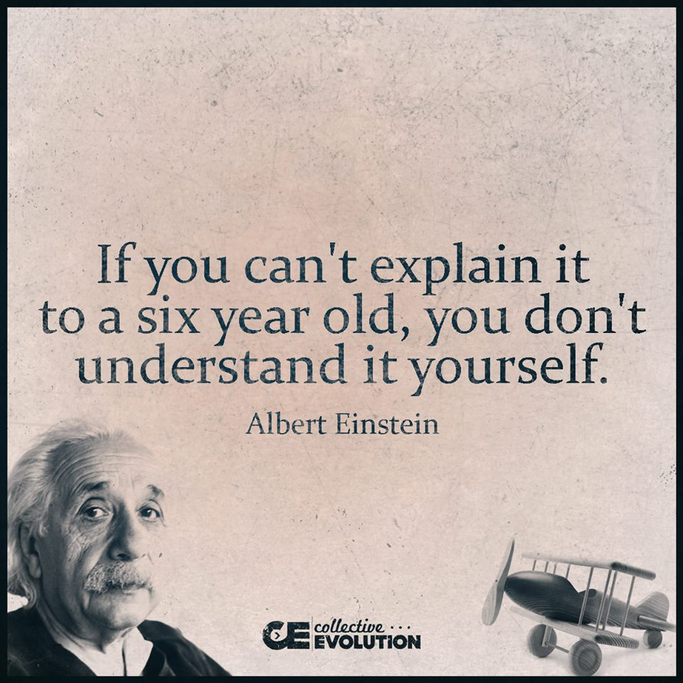

# [kop 1 voorbeeld tekst]
Dit is een voorbeeld tekst.

Als je iets nadruk wilt geven: *tekst met nadruk (schuingedrukt)*. Of: _zo kan het ook_.

Sterke nadruk doe je zo: **tekst met sterke nadruk**.

Kop niveau's geef je aan met hashtags.

Om speciale blokken tekst te maken moet je toch een beetje HTML gebruiken:

<aside class="example">
Voorbeeld hier...
</aside>

<aside class="note">
Noot tekst hier...
</aside>

<aside class="issue" data-number="1">
Issue tekst hier...
</aside>

<aside class="warning">
Waarschuwing hier...
</aside>

## kop 2

### kop 3

#### kop 4

# meer voorbeelden
Voorbeeld tekst.
Lijstje:
- item 1
- item 2
- item 3

Genummerd lijstje:
1. item
2. item
3. item

Links:
- [link naar iets](http://www.example.com)
- [meer over Markdown](https://guides.github.com/features/mastering-markdown/)

(*Als je afbeeldingen wilt opnemen moeten die al ergens op het internet staan, want je verwijst ernaar met een URL. Liefst zet je ze in de github repository waar je document ook in staat. Zet ze dan in de `\media` folder. Je kan dan een relatieve URL gebruiken, bv* `media/fig1.jpg`.)

Tabel:

*Vóór een tabel moet je een witregel zetten, anders werkt het niet*

|**Kolom 1** | **Kolom 2** | **Kolom 3** |
|------------|-------------|-------------|
| rij 1 cel  | rij 1 cel   | rij 1 cel   |
| rij 2 cel  | rij 2 cel   | rij 2 cel   |
| rij 3 cel  | rij 3 cel   | rij 3 cel   |
